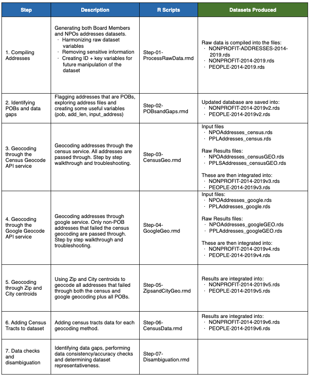
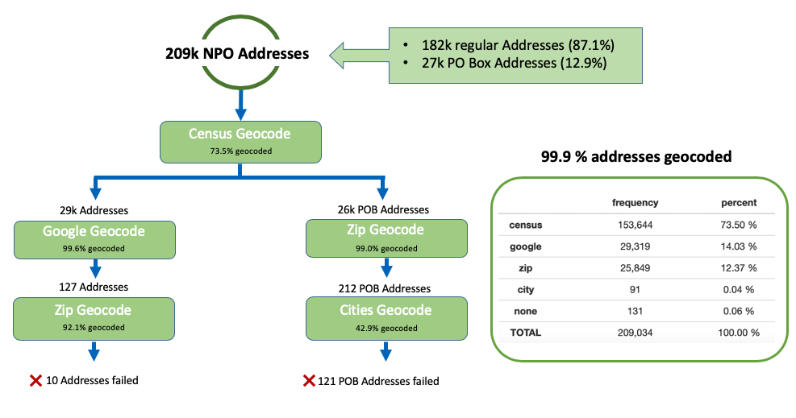
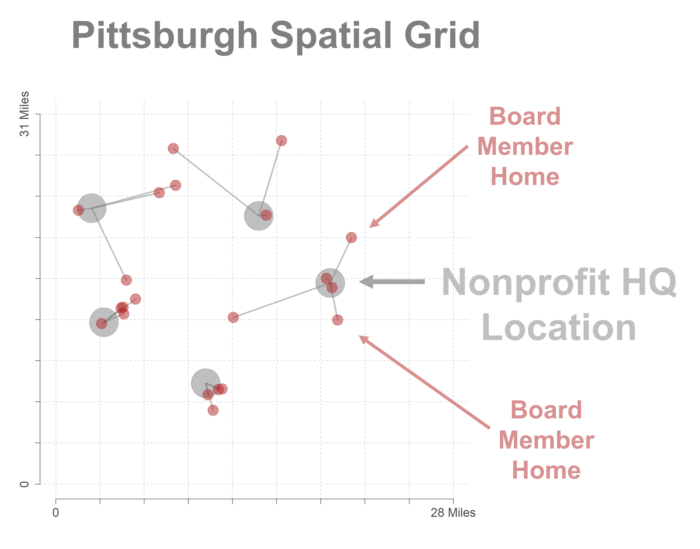
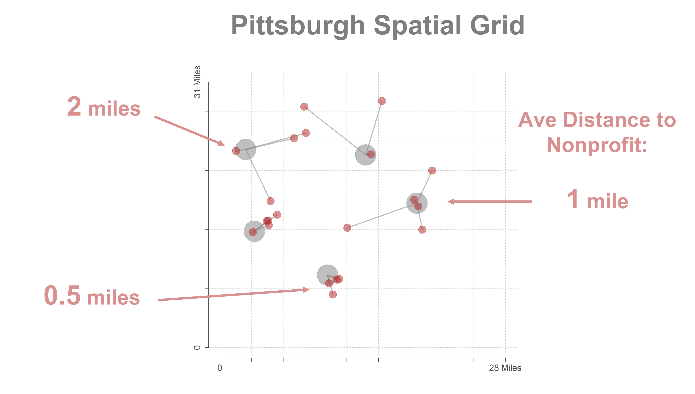
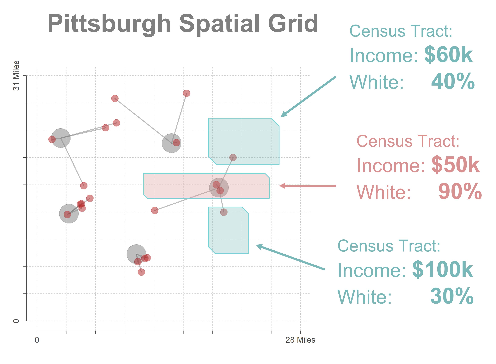

```{r setup, include=FALSE}
knitr::opts_chunk$set( echo = TRUE, message=F, warning=F, fig.width=10 )
```


# Setup 
 
## Package Installation

Note that postmastr is not available on CRAN:

```{r, eval=F}
remotes::install_github("slu-openGIS/postmastr")

p <- c( "tidyverse","stringi","tidycensus",
        "textclean","tidygeocoder" )
install.packages(p)
```


```{r}
library( postmastr )
library( tidyverse )
library( stringi )
library( tidycensus )
library( textclean )
library( tidygeocoder )
```


# Geocoding Addresses


## Data Cleaning with the `postmastr` Package 


**Basic Organization of postmastr**

To parse our grammar of street addresses, functions can be grouped in two ways. All functions begin with the prefix pm_ in order to take advantage of RStudio’s auto-complete functionality.

First, we have major groups of functions based on their associated grammatical element:

* house - house number
* houseAlpha - alphanumeric house number
* houseFrac - fractional house number
* street - street name
* streetDir - street prefix and suffix direction
* streetSuf - street suffix
* unit - unit name and number
* city - city
* state - state
* postal - postal code

For each group of function, we have a similar menu of options that describe the verb (action) the function implements. For the state family of functions, for instance:

* pm_state_detect() - does a given street address contain a state name or abbreviation?
* pm_state_any() - does a any street address contain a state name or abbreviation?
* pm_state_all() - do all street addresses contain a state name or abbreviation?
* pm_state_none() - returns a tibble of street addresses that do not contain a state name or abbreviation
* pm_state_parse() - parses street addresses that do contain a street name or abbreviation
* pm_state_std() - standardizes the parsed state data to return upper-case abbreviations


### Building Dictionaries

*Thanks to Akila Forde for contributions to this section.*

The `postmastr` packages utilizes a collection of "dictionaries" that are used for standardization and disambiguation purposes.

```{r}
x.dir <- pm_dictionary( type = "directional", 
                        locale = "us",
                        filter = c("N", "S", "E", "W", "NE", "NW", "SW", "SE"))

head( x.dir, 10 )

x.state <- pm_dictionary( type = "state", 
                          case = c("upper"), 
                          locale = "us")
head( x.state, 10 )
```

*NOTE: The city dictionary functionality is powered by the get_acs function from the tidycensus package. This requires a Census Bureau API key, which can be obtained at http://api.census.gov/data/key_signup.html. Once you have a key, the census_api_key function from tidycensus should be used to set-up the key before proceeding with the creation of any dictionary objects for cities. (Excludes Armed Americas, Armed Americas Europe Middle East etc)*

```{r, echo=F, eval=F}
tidycensus::census_api_key( "84381427d420f30520867a40efed18b32acc5993",
                            install=TRUE )
```

```{r, eval=F}
tidycensus::census_api_key( "yourkeyhere" )
```


```{r}
af_pm_dictionary_us_cities <- function(append, states){

  out <- af_pm_get_tidycensus(states = states)

  # optionally append
  if (missing(append) == FALSE){

    # bind rows
    out <- dplyr::bind_rows(out, append)

    # re-order observations
    out <- out[order(out$city.input),]

  }

  # return output
  return(out)

}

# us cities via tidycensus
af_pm_get_tidycensus <- function(states){

  # global bindings
  state.abb = NAME = NULL

  # download data
  states %>%
    base::split(states) %>%
    purrr::map_df(~ suppressMessages(
      tidycensus::get_acs(year = 2020, state = .x, geography = "place", variable = "B01003_001"))) -> data

  # create state dictionary
  dict <- data.frame(
    state.name = c(datasets::state.name),
    state.abb = c(datasets::state.abb),
    stringsAsFactors = FALSE
  )

  dict <- dplyr::filter(dict, state.abb %in% states)
  dict <- dict$state.name

  # parse state names
  data %>%
    dplyr::select(NAME) %>%
    dplyr::mutate(NAME = stringr::str_replace_all(NAME, pattern = ",", replace = "")) %>%
    pm_parse_place(dictionary = dict) %>%
    dplyr::mutate(NAME = stringr::str_trim(NAME, side = "right")) -> data

  # create directory
  dict <- c("city", "town", "village", "CDP")

  # parse place types
  data %>%
    pm_parse_place(dictionary = dict) -> data

  # clean-up output
  data %>%
    dplyr::mutate(NAME = stringr::str_trim(NAME, side = "right")) %>%
    dplyr::distinct(NAME, .keep_all = TRUE) %>%
    dplyr::rename(city.input = NAME) -> data

  # re-order observations
  data <- data[order(data$city.input),]

  # return output
  return(data)

}

pm_parse_place <- function(.data, dictionary){

  # global bindings
  NAME = pm.place = NULL

  # iterate over observations
  .data %>%
    dplyr::mutate(pm.place = purrr::map(NAME, ~ pm_extract_pattern(.x, dictionary = dictionary, end = TRUE))) -> .data

  # clean address data
  .data %>%
    tidyr::unnest(pm.place) %>%
    dplyr::filter(is.na(pm.place) == FALSE) %>%
    dplyr::mutate(pm.place = as.character(pm.place)) %>%
    dplyr::mutate(NAME = stringr::str_replace(NAME,
                                              pattern = stringr::str_c("\\b", pm.place, "\\b$"),
                                              replacement = "")) %>%
    dplyr::select(-pm.place) -> .data

  return(.data)

}


# iterate over dictionary items per observations
pm_extract_pattern <- function(x, dictionary, end = TRUE){

  # create pattern vector
  patternVector <- dictionary

  patternVector %>%
    base::split(patternVector) %>%
    purrr::map( ~ stringr::str_extract(x, pattern = ifelse (end == TRUE,
                                                            stringr::str_c("\\b", .x, "\\b$"),
                                                            stringr::str_c("\\b", .x, "\\b")))) -> out

  return(out)

}
```


```{r, eval=T}
# takes a bit to process
x.city <- af_pm_dictionary_us_cities(,state.abb) %>% mutate_if(is.character, str_to_upper)
head( x.city )
```

```{r, echo=F}
structure(list(city.input = c("ABANDA", "ABBEVILLE", "ABBOTSFORD", 
"ABBOTT", "ABBS VALLEY", "ABBYVILLE", "ABERCROMBIE", "ABERDEEN", 
"ABERDEEN GARDENS", "ABERDEEN PROVING GROUND", "ABERNATHY", "ABEYTAS", 
"ABIE", "ABILENE", "ABINGDON", "ABINGTON", "ABIQUIU", "ABITA SPRINGS", 
"ABNEY CROSSROADS", "ABRAM", "ABRAMS", "ABSAROKEE", "ABSECON", 
"ABSECON HIGHLANDS", "ACACIA VILLAS")), row.names = c(NA, -25L
), class = c("tbl_df", "tbl", "data.frame"))
```


### Zip Code Cleanup


```{r}
address <- 
 c(
	"1 WEST 54TH ST NO 38, NEW YORK, NY  10019",
	"202 FLANDERS DRAKESTOWN ROAD, FLANDERS, NJ  7836",
	"PO BOX 840, ARLINGTON, MN  55307",
	"7211 HAVEN AVENUE SUITE E-565, RANCHO CUCAMONGA, CA  91701",
	"18810 U S HWY 41, MASARYKTOWN, FL  34604",
	"1200 W INTERNATIONAL SPEEDWAY BLVD, DAYTONA BEACH, FL  32114", 
	"16105 SWINGLEY RIDGE ROAD UNIT 773, CHESTERFIELD, MO  63017",
	"C/O EVAN RUSSO 57 TAYLOR BROOK RD, HANCOCK, VT  5748",
	"2917 E 47TH ST APT B, INDIANAPOLIS, IN  46205",
	"3280 N 960 E, LEHI, UT  84043",
	"702 SECOND AVE E, OSKALOOSA, IA  52577",
	"3875 POWDER SPRINGS RD STE C, POWDER SPRINGS, GA  30127",
	"1730 GIDDINGS AVENUE SOUTHEAST, GRAND RAPIDS, MI  49507", 
	"PO BOX 74, TAHOLAH, WA  98587",
	"BOX 444, INKSTER, MI  48141",
	"1990 NE 163RD STREET - SUITE 233, NORTH MIAMI BEACH, FL  33162",
	"ONE BEAR PLACE 98006, WACO, TX  76798", 
	"3023 S UNIVERSITY DRIVE 103, FORT WORTH, TX  76109",
	"POST OFFICE BOX 6037, ALAMEDA, CA  94501"
 )
```

Missing numbers in zip codes:

```{r}
address[c(2,8)]
```

```{r}
# Assumes the zipcodes are always the last word in the addess, code below has infrastructure if no zip
x.last_words <- stri_extract_last_words( address )


## Loop to add a zero in front of any shortened zipcodes, only if the zipcode is four digits long
for ( i in 1:length( x.last_words ) ){
  if ( nchar( x.last_words[i]) == 4 ) 
    {
       address[i] <- 
         paste( word( address[i], 1,-2 ),
         paste0( "0", x.last_words[i] ) ) 
    }
}

address[c(2,8)]
```


### Parsing Addresses 

```{r}
# requires a data frame
id <- paste0( "id-", 1:length(address) )
d.address <- data.frame( id, address )
head( d.address )

## Need to ensure the data have a unique identification
d.address <- pm_identify( d.address, var="address" )
head( d.address )
```


```{r}
## Parse the data for cities, and address
d.parsed <- 
  d.address %>% 
  pm_parse( input='full', 
            address="address", 
            output = "short", 
            keep_parsed = "limited",
            dir_dict=x.dir, 
            state_dict=x.state, 
            city_dict=x.city )

d.parsed <- d.parsed %>%  mutate_if( is.character, str_to_upper )
d.parsed 
```


<br>
<br>


## Geocoding with `tidygeocoder`


https://jessecambon.github.io/tidygeocoder/


### Demo 

```{r}
library(tibble)
library(dplyr)
library(tidygeocoder)

address_single <- tibble(singlelineaddress = c(
  "11 Wall St, NY, NY",
  "600 Peachtree Street NE, Atlanta, Georgia"
))

address_components <- tribble(
  ~street, ~cty, ~st,
  "11 Wall St", "NY", "NY",
  "600 Peachtree Street NE", "Atlanta", "GA"
)
```


```{r}
census_s1 <- address_single %>%
  geocode(address = singlelineaddress, method = "census", verbose = TRUE)
#> 
#> Number of Unique Addresses: 2
#> Executing batch geocoding...
#> Batch limit: 10,000
#> Passing 2 addresses to the US Census batch geocoder
#> Querying API URL: https://geocoding.geo.census.gov/geocoder/locations/addressbatch
#> Passing the following parameters to the API:
#> format : "json"
#> benchmark : "Public_AR_Current"
#> vintage : "Current_Current"
#> Query completed in: 1 seconds
```

```{r}
osm_s1 <- geo(
  address = address_single$singlelineaddress, method = "osm",
  lat = latitude, long = longitude
)
#> Passing 2 addresses to the Nominatim single address geocoder
#> Query completed in: 2 seconds
```


### Geocoding API Options

```
geo( ..., method="osm" )
```

**method = the geocoding service used in the call.** 


* "osm": Open Street Map (default)
* "census": US Census. Geographic coverage is limited to the United States. Batch geocoding is supported.
* "arcgis": ArcGIS.
* "geocodio": Geocodio. Geographic coverage is limited to the United States and Canada. An API key must be stored in the environmental variable "GEOCODIO_API_KEY". Batch geocoding is supported.
* "iq": Location IQ. An API key must be stored in the environmental variable "LOCATIONIQ_API_KEY".
* "google": Google. An API key must be stored in the environmental variable "GOOGLEGEOCODE_API_KEY".
* "opencage": OpenCage. An API key must be stored in the environmental variable "OPENCAGE_KEY".
* "mapbox": Mapbox. An API key must be stored in the environmental variable "MAPBOX_API_KEY".
* "here": HERE. An API key must be stored in the environmental variable "HERE_API_KEY". Batch geocoding is supported, but must be explicitly called with mode = "batch".
* "tomtom": TomTom. An API key must be stored in the environmental variable "TOMTOM_API_KEY". Batch geocoding is supported. 
* "mapquest": MapQuest. An API key must be stored in the environmental variable "MAPQUEST_API_KEY". Batch geocoding is supported.
* "bing": Bing. An API key must be stored in the environmental variable
"BINGMAPS_API_KEY". Batch geocoding is supported, but must be explicitly called with mode = "batch".
* "geoapify": Geoapify. An API key must be stored in the environmental variable "GEOAPIFY_KEY". 
* "cascade" [Deprecated] use geocode_combine or geo_combine instead. 

**Cascade Option:** 

The "cascade" method first uses one geocoding service and then uses a second geocoding service if the first service didn’t return results. The services and order is specified by the cascade_order argument. Note that this is not
compatible with full_results = TRUE as geocoding services have different columns that they return.

**Primary Considerations:**

* Do they allow batch processing? 
* Do they use machine learning to match addresses? 
  - Census is pretty literal 
  - Google Maps API is 'smart'
* Are there limits? 
* What is the price? 


### API Keys

<hr>

**Getting Keys**

It is different for every service, but for some it is a simple request: 

https://api.census.gov/data/key_signup.html


<br>
<hr>
<br>

**Installing Keys**

API keys are loaded from R environmental variables. 

```{r, eval=F}
usethis::edit_r_environ()
# add: 
GEOCODIO_API_KEY="YourAPIKeyHere"
```

Run usethis::edit_r_environ() to open your .Renviron file and add an API key as an environmental variable. For example, add the line GEOCODIO_API_KEY="YourAPIKeyHere"


## Project Example

https://nonprofit-open-data-collective.github.io/open-1023-ez-dataset/

1. Clean up addresses. 
2. Geocode first with the free Census tool.
3. Send unsuccessful cases to Google Maps API. 
4. Geocode PO Boxes by post office. 
5. Geocode incomplete / incorrect addresses by ZIP. 






# Distance

## Euclidian Distance 






```{r, echo=F}
d <- 
structure(list(id = c("ID-2014-020783630-01", "ID-2014-020783630-02", 
"ID-2014-020783630-03", "ID-2014-020783630-04", "ID-2014-020783630-05"
), ORGNAME = c("LLANO ESTACADO CHAPTER TEXAS MASTER-NATURALISTS", 
"LLANO ESTACADO CHAPTER TEXAS MASTER-NATURALISTS", "LLANO ESTACADO CHAPTER TEXAS MASTER-NATURALISTS", 
"LLANO ESTACADO CHAPTER TEXAS MASTER-NATURALISTS", "LLANO ESTACADO CHAPTER TEXAS MASTER-NATURALISTS"
), EIN = c("020783630", "020783630", "020783630", "020783630", 
"020783630"), Signaturedate = c("8/25/2014", "8/25/2014", "8/25/2014", 
"8/25/2014", "8/25/2014"), Case.Number = c("EO-2014239-000189", 
"EO-2014239-000189", "EO-2014239-000189", "EO-2014239-000189", 
"EO-2014239-000189"), Firstname = c("KATHRYN", "PAT", "DON", 
"MARY JANE", "PAUL"), Lastname = c("LUPARDUS", "HUNTER", "CARLTON", 
"BROWN", "BROWN"), Title = c("PRES", "VP", "TREAS", "SEC", "PAST PRES"
), Address = c("4450 PARKHURST DR", "2312 GULF AVE", "1301 DAVENTRY PL", 
"5801 SUNDANCE PL", "5010 BELLE GROVE CT"), City = c("MIDLAND", 
"MIDLAND", "MIDLAND", "MIDLAND", "MIDLAND"), State = c("TX", 
"TX", "TX", "TX", "TX"), Zip = c(79707L, 79705L, 79705L, 79707L, 
79705L), Zippl4 = c(0L, 0L, 0L, 0L, 0L), gender = c("female", 
"female", "male", NA, "male"), proportion_male = c(0.0025, 0.3592, 
0.9937, NA, 0.996), key = 203:207, input_address = c("4450 PARKHURST DR, MIDLAND, TX, 79707", 
"2312 GULF AVE, MIDLAND, TX, 79705", "1301 DAVENTRY PL, MIDLAND, TX, 79705", 
"5801 SUNDANCE PL, MIDLAND, TX, 79707", "5010 BELLE GROVE CT, MIDLAND, TX, 79705"
), match = c("Match", "Match", "Match", "Match", "Match"), match_type = c("Exact", 
"Exact", "Exact", "Exact", "Exact"), out_address = c("4450 Parkhurst Dr, MIDLAND, TX, 79707", 
"2312 Gulf Ave, MIDLAND, TX, 79705", "1301 Daventry Pl, MIDLAND, TX, 79705", 
"5801 Sundance Pl, MIDLAND, TX, 79707", "5010 Belle Grove Ct, MIDLAND, TX, 79705"
), lat_lon = c("-102.14035,32.028698", "-102.10558,32.0139", 
"-102.1047,32.04242", "-102.1652,32.009197", "-102.1161,32.04332"
), tiger_line_id = c(139578310L, 139579372L, 139579156L, 139592534L, 
139595564L), tiger_line_side = c("R", "R", "R", "L", "R"), state_fips = c(48L, 
48L, 48L, 48L, 48L), county_fips = c(329L, 329L, 329L, 329L, 
329L), tract_fips = c(304L, 303L, 10108L, 10112L, 10107L), block_fips = c(1011L, 
2005L, 2008L, 4027L, 2001L), lon = c(-102.14035, -102.10558, 
-102.1047, -102.1652, -102.1161), lat = c(32.028698, 32.0139, 
32.04242, 32.009197, 32.04332)), row.names = 203:207, class = "data.frame")
d
```


```{r}
d <-
structure(list(id = c("ID-2014-020783630-01", "ID-2014-020783630-02", 
"ID-2014-020783630-03", "ID-2014-020783630-04", "ID-2014-020783630-05"
), lon = c(-102.14035, -102.10558, -102.1047, -102.1652, -102.1161
), lat = c(32.028698, 32.0139, 32.04242, 32.009197, 32.04332)), row.names = 203:207, class = "data.frame")

```


```{r}
library( geosphere )

# distm returns a vector of distances in meters
dat <-d[c("lon","lat")]
rownames( dat ) <- d$id
distm( dat, fun = distGeo ) # in meters

# in miles
distm( dat, fun = distGeo ) * 0.001 * 0.621371
```


## Geodesic (Spherical) Distance

```{r}
###
###     CONVERT LATITUDE AND LONGITUDE COORDINATES TO KILOMETERS
###     

# degrees to radians 

deg2rad <- function(deg) 
{ return(deg*pi/180) } 


# Calculates the geodesic distance between two points specified by 
# latitude/longitude using the Haversine formula.
# Note that lat/long are converted to radians so they 
# can be passed to sin/cos functions.

gcd.hf <- function(long1, lat1, long2, lat2) 
{ 

	R <- 6371 # R is a constant for the Earth mean radius [km] 
	
	delta.long <- deg2rad(long2 - long1) 
	delta.lat <- deg2rad(lat2 - lat1) 
	
	a <- sin(delta.lat/2)^2 + cos(deg2rad(lat1)) * cos(deg2rad(lat2)) * sin(delta.long/2)^2 
	c <- 2 * asin(min(1,sqrt(a))) 
	d = R * c 
	
	return(d) # Distance in km 
} 


# gcd.hf(long1=-86.64147, lat1=32.54221, long2=-87.75474, lat2=30.65488) 
# should be 234.9


calcDists <- function( latlongs, toMiles=T ) 
{ 
	name <- list(rownames(latlongs), rownames(latlongs)) 
	n <- nrow(latlongs) 
	z <- matrix(0, n, n, dimnames = name) 
	
	for (i in 1:n) 
	{ 
	  for (j in 1:n) 
	  {
	    z[i, j] <- gcd.hf( long1 = latlongs[i, 2], lat1 = latlongs[i,1], 
	                       long2 = latlongs[j, 2], lat2 = latlongs[j,1]  ) 
	  } 
	} 
	
	if( toMiles == T )
	{ z <- z * 0.621371192 }
	
	return(z) 
}

```


## Travel Time

https://www.jla-data.net/eng/routing-in-r-context/

https://github.com/lecy/CityBikeNYC

```{r, eval=F}
library( ggmap )

rt <- route( from=c(-73.96905,40.75002), 
             to=c(-73.99148,40.72229), 
             mode="bicycling",
             structure="route" )

nyc <- qmap( "New York City, NY", color='bw', zoom=13 )  

nyc +  geom_path(  aes( x = rt$lon , y = rt$lat ), 
            colour="#1E2B6A", data=rt, alpha=1, size=2 )


rt
     m    km     miles seconds    minutes       hours leg       lon      lat
1   96 0.096 0.0596544      12  0.2000000 0.003333333   1 -73.96898 40.74999
2  228 0.228 0.1416792      83  1.3833333 0.023055556   2 -73.96842 40.75075
3 3510 3.510 2.1811140     703 11.7166667 0.195277778   3 -73.97079 40.75174
4   42 0.042 0.0260988       7  0.1166667 0.001944444   4 -73.99096 40.72412
5  158 0.158 0.0981812      70  1.1666667 0.019444444   5 -73.99103 40.72375
6   15 0.015 0.0093210      23  0.3833333 0.006388889   6 -73.99165 40.72241
7    8 0.008 0.0049712      22  0.3666667 0.006111111   7 -73.99149 40.72237
8   NA    NA        NA      NA         NA          NA  NA -73.99152 40.72230
```


# Linking Census Data


To add Census data you either need (1) FIPS codes for your geographic units like counties, tracts, blocks, etc. or (2) latitude and longitude coordinates used for a spatial join. 


## GeoMarker 

[IPUMS GeoMarker tool](https://ds4ps.org/2019/05/01/census-geomarker-tool.html)

Upload your file with lat-lon coordinates to the IPUMS website and they will return a file with ~20 census fields appended to the dataset. 


## Spatial Join Option



<br>
<br>

1. Download a shapefile with your desired census fields. 
2. Create a spatial join of your lat-lon coordinates and shapefiles, which will associate the census data with the correct data points. 

```{r, eval=F}
library( dplyr )
library( sf )
library( tigris )

### Spatial join appending polygon data frame to any
### points contained within the polygons
### sf::st_join( d.sf, tracts, join = st_within, left=FALSE )

### Download tract shapefiles from Census
### tigris::tracts( state=state, year="2010" )


d <- readRDS( "Data/_Latest_dataset/NPO_2014-2020.rds" )
d2 <- select( d, ID, lat, lon )
d3 <- filter( d2, ! is.na(lat) )

d.sf <- st_as_sf( d3, coords=c("lon","lat"), crs=4326 )

# get state names - all 50 + DC
tab <- table( d$State ) 
tab <- tab[ tab > 600 ]
states <- names(tab)

get_tracts <- function( state )
{
  t <- tigris::tracts( state=state, year="2010" )
  t <- sf::st_transform( t, 4326 )
  return(t)
}


results <- NULL

for( i in states )
{
  tracts <- get_tracts( i )
  df <- sf::st_join( d.sf, tracts, join = st_within, left=FALSE )
  results <- dplyr::bind_rows( results, df )
}


df <- as.data.frame( results )
df <- unique( df )
dd <- merge( d, df, by="ID", all.x=TRUE )
```


<style>

td{ padding: 6px 10px 6px 10px } 
th{ text-align: left; } 
h1, h3, h4 { color: #995c00; }
h1,h2, h3 { margin-top:50px; }
body{
     font-family:system-ui,-apple-system,"Segoe UI",Roboto,Helvetica,Arial,sans-serif;
     font-size:calc(1.5em + 0.25vw);
     font-weight:300;line-height:1.65;
     margin-left:20%;
     margin-right:20% }
     
</style>